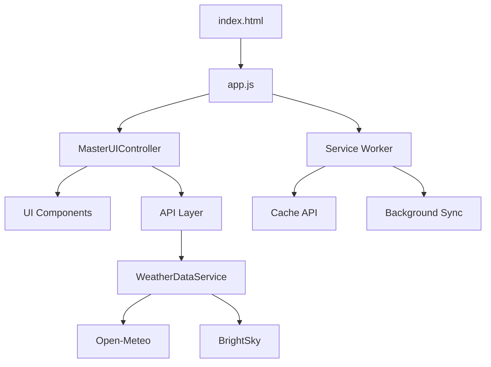

# 📚 Calchas - Vollständige Dokumentation

> **Version:** 0.1.1-alpha  
> **Letzte Aktualisierung:** 01.02.2026  
> **Status:** Erste funktionale Alpha-Version

---

## 📋 Inhaltsverzeichnis

1. [Projekt-Übersicht](#1-projekt-übersicht)
2. [Installation & Setup](#2-installation--setup)
3. [Entwicklung](#3-entwicklung)
4. [Versions-Management](#4-versions-management)
5. [Caching-System](#5-caching-system)
6. [Architektur](#6-architektur)
7. [Deployment](#7-deployment)

---

## 1. Projekt-Übersicht

### Was ist Calchas?

Calchas ist eine moderne **Progressive Web App (PWA)** für Wetterdaten mit:

- ✅ Aktuelles Wetter & 7-Tage-Vorhersage
- ✅ Interaktives Wetter-Radar mit Layern
- ✅ Health & Safety Center (Windchill, Luftqualität, UV-Index)
- ✅ Historische Datenansicht & Trends
- ✅ Offline-First Architektur
- ✅ Keine Registrierung, Privacy-First

### Features

| Feature | Beschreibung |
|---------|--------------|
| **Dual-API System** | Open-Meteo & BrightSky Fallback |
| **Radar-Karten** | Niederschlag, Temperatur, Wind, Wolken |
| **Historie** | Wetterdaten-Rückblick und Analysen |
| **PWA** | Installierbar, Offline-Modus |
| **Mehrsprachig** | Deutsch & Englisch |
| **Themes** | Dark/Light Mode |

### Tech Stack

- **Frontend:** Vanilla JavaScript (ES6+)
- **PWA:** Service Worker, Cache API
- **Maps:** Leaflet.js
- **APIs:** Open-Meteo, BrightSky, Nominatim
- **Build:** Versionless (kein Bundler)

---

## 2. Installation & Setup

### Voraussetzungen

- Node.js (v18+) für Entwickler-Tools
- Git
- Moderner Browser (Chrome, Firefox, Safari, Edge)

### Projekt klonen

```bash
git clone https://github.com/BFS-IT-AB/calchas.git
cd calchas
npm install
```

### Lokaler Server starten

```bash
# HTTP-Server (für PWA-Tests)
npm run dev

# Oder Python (falls Node nicht verfügbar)
python -m http.server 8080
```

App öffnen: `http://localhost:8080`

### PWA installieren (Testing)

1. App im Browser öffnen
2. DevTools → Application → Manifest → "Add to homescreen"
3. Service Worker registriert sich automatisch

---

## 3. Entwicklung

### Projekt-Struktur

```
calchas/
├── index.html              # Haupt-HTML
├── app.js                  # App-Einstiegspunkt
├── service-worker.js       # PWA Service Worker
├── manifest.json           # PWA Manifest (SOURCE OF TRUTH für Version!)
├── css/                    # Styles
│   ├── style.css
│   └── mobile.css
├── js/
│   ├── api/               # API-Layer (weather, brightsky, etc.)
│   ├── ui/                # UI-Komponenten
│   │   ├── home/         # Home-View
│   │   ├── health/       # Health-View
│   │   ├── history/      # History-View
│   │   ├── map/          # Map-View
│   │   ├── settings/     # Settings-Sheets
│   │   └── modals/       # Modals & Detail-Sheets
│   ├── utils/            # Utilities (cache, validation, etc.)
│   ├── logic/            # Business Logic (HealthEngine)
│   ├── config/           # Konfiguration (changelog.js)
│   └── i18n/             # Internationalisierung
├── assets/               # Icons, Screenshots, Logos
├── dev/                  # Entwickler-Tools
│   ├── tools/           # Scripts (sync-version.js)
│   └── tests/           # Tests
└── legal/               # Datenschutz, AGB
```

### Code-Konventionen

- **ES6 Modules:** Keine globalen Variablen
- **Async/Await:** Für alle API-Calls
- **Event Delegation:** Zentrale Event-Listener
- **CSS Custom Properties:** Design-Tokens
- **Mobile-First:** Responsive Design

---

## 4. Versions-Management

### 🎯 System-Übersicht

Calchas nutzt **Dual-Versioning**:

```
APP_VERSION  = "0.1.1-alpha"        (SemVer - User-facing)
BUILD_ID     = "2026-02-01-1840"     (Timestamp - Build-Tracking)
CACHE_NAME   = "calchas-2026-02-01-1840"  (Service Worker Cache)
```

### Single Source of Truth: `manifest.json`

**Nur hier wird die Version geändert:**

```json
{
  "version": "0.1.1-alpha"
}
```

Alle anderen Dateien werden **automatisch** synchronisiert!

### Workflow: Neue Version veröffentlichen

```bash
# 1. manifest.json bearbeiten
vim manifest.json
# "version": "0.2.0-alpha"

# 2. changelog.js aktualisieren
vim js/config/changelog.js
# Neuen Entry an Index 0 einfügen (siehe Beispiel unten)

# 3. Commit (Git Hook synchronisiert automatisch!)
git add manifest.json js/config/changelog.js
git commit -m "chore: bump version to v0.2.0-alpha"

# Der Git Pre-Commit Hook macht automatisch:
# - Liest Version aus manifest.json
# - Generiert neue BUILD_ID
# - Aktualisiert service-worker.js
# - Staged service-worker.js
```

### Changelog-Entry hinzufügen

```javascript
// js/config/changelog.js
const CHANGELOG = [
  {
    version: "0.2.0-alpha",          // Neue Version
    date: "05.02.2026",
    isLatest: true,                  // WICHTIG!
    title: "Feature XYZ hinzugefügt",
    changes: [
      {
        emoji: "✨",
        type: "Added",
        text: "Neue Funktion XYZ",
      }
    ]
  },
  {
    version: "0.1.1-alpha",
    isLatest: false,                 // Alte Version auf false!
    // ...
  }
]
```

### Git Pre-Commit Hook

**Automatisch aktiv** (nach `chmod +x .git/hooks/pre-commit`):

Bei jedem Commit:
1. Liest Version aus `manifest.json`
2. Generiert neue `BUILD_ID` (Timestamp)
3. Prüft ob `service-worker.js` synchron ist
4. Falls nicht: Führt `npm run version-sync` aus
5. Staged `service-worker.js` automatisch

**Manueller Test:**

```bash
# Linux/macOS
.git/hooks/pre-commit

# Windows (PowerShell)
.\.git\hooks\pre-commit.ps1
```

**Hook aktivieren (Linux/macOS):**

```bash
chmod +x .git/hooks/pre-commit
```

### Manueller Version-Sync (optional)

Falls du Version-Sync ohne Commit ausführen willst:

```bash
npm run version-sync
```

---

## 5. Caching-System

### Dual-Cache-Architektur

Calchas nutzt **zwei separate Caches**:

| Cache | Inhalt | TTL | Lifecycle |
|-------|--------|-----|-----------|
| `CACHE_NAME` | App Shell (HTML, CSS, JS) | Permanent | Bei jedem Deploy neu |
| `HEALTH_CACHE_NAME` | Health-Berechnungen | 30 Min | Persistent über Updates |

### Service Worker Cache

**150+ Dateien gecacht:**

```javascript
const urlsToCache = [
  "/",
  "/index.html",
  "/app.js",
  "/manifest.json",
  "/css/style.css",
  "/js/api/weather.js",
  "/js/ui/MasterUIController.js",
  // ... insgesamt 150+ Files
];
```

**Offline-Fallback (5-Stufen):**

1. Netzwerk-Request
2. Aktueller Cache
3. Alte Caches durchsuchen
4. Index.html Fallback (HTML-Requests)
5. 503 JSON Response

### Client-Side Cache (CacheManager)

**localStorage-basiert mit TTL:**

```javascript
const cache = new CacheManager();

// Speichern
cache.set("weather_berlin", weatherData, "WEATHER"); // 30 Min TTL

// Abrufen
const data = cache.get("weather_berlin");
if (!data) {
  // Cache miss - neu laden
}
```

**QuotaExceededError Handling:**

Bei vollem localStorage: Löscht automatisch **älteste 25%** der Einträge.

### Service Worker Diagnostics

**Browser Console Commands:**

```javascript
// Cache-Statistiken
const mc = new MessageChannel();
mc.port1.onmessage = e => console.log(e.data);
navigator.serviceWorker.controller.postMessage(
  { type: 'GET_DIAGNOSTICS' },
  [mc.port2]
);

// Cache-Integrität prüfen
navigator.serviceWorker.controller.postMessage(
  { type: 'VALIDATE_CACHE' },
  [mc.port2]
);

// Alle Caches löschen (Testing)
navigator.serviceWorker.controller.postMessage(
  { type: 'CLEAR_ALL_CACHES' },
  [mc.port2]
);
```

---

## 6. Architektur

### System-Komponenten



### UI-Architektur

- **MasterUIController:** Zentrale Steuerung aller Modals & Sheets
- **Event Delegation:** Single Listener auf `#main`
- **CSS-Only Transitions:** `.is-visible`, `.is-active`
- **Single Backdrop:** Globales Scrim-Element

### Datenfluss

```
User Input → UI Component → API Service → WeatherDataService
            ↓                              ↓
         Cache Check ←──────────────── Service Worker
            ↓
      Render UI ← Transform Data
```

### Key Files

| Datei | Zeilen | Verantwortung |
|-------|--------|---------------|
| `app.js` | ~400 | App-Initialisierung, Routing |
| `service-worker.js` | ~1015 | PWA Cache, Background Sync, Diagnostics |
| `MasterUIController.js` | ~800 | UI-State-Management |
| `WeatherDataService.js` | ~500 | API-Abstraktion, Fallback-Logic |
| `HealthEngine.js` | ~300 | Health-Berechnungen (Windchill, UV, etc.) |

---

## 7. Deployment

### Production Build

```bash
# 1. Version erhöhen
vim manifest.json  # "version": "0.2.0"

# 2. Changelog aktualisieren
vim js/config/changelog.js

# 3. Version synchronisieren
npm run version-sync

# 4. Committen (Hook läuft automatisch)
git add .
git commit -m "chore: release v0.2.0"

# 5. Pushen
git push origin main
```

### Service Worker Update

Bei neuem Deploy:

1. Neue Version von `service-worker.js` wird erkannt
2. Browser lädt neue Version im Hintergrund
3. `install` Event → Cached neue Dateien
4. `activate` Event → Löscht alte Caches
5. `clients.claim()` → Übernimmt alle offenen Tabs

User sieht sofort neue Version (kein Hard-Reload nötig)!

### Cache-Invalidierung

**Automatisch bei jedem Deploy:**

- Neuer `CACHE_NAME = "calchas-2026-02-01-1840"`
- Service Worker löscht alle alten Caches
- Neue Dateien werden gecacht
- Health-Cache bleibt persistent

---

## 🔧 Troubleshooting

### Version wird nicht aktualisiert

**Problem:** About-Modal zeigt alte Version

**Lösung:**
```javascript
// Browser Console
caches.keys().then(names => Promise.all(names.map(n => caches.delete(n))));
location.reload(true);
```

### Service Worker cached nicht

**Problem:** Offline-Modus funktioniert nicht

**Lösung:**
1. DevTools → Application → Service Workers → Unregister
2. DevTools → Application → Clear storage
3. Page reload (F5)

### Git Hook läuft nicht

**Problem:** Hook wird nicht ausgeführt

**Lösung:**
```bash
# Linux/macOS
chmod +x .git/hooks/pre-commit

# Test
.git/hooks/pre-commit
```

---

## 📚 Weitere Ressourcen

- **Website:** https://calchas.dev
- **GitHub:** https://github.com/BFS-IT-AB/calchas
- **Datenschutz:** [legal/privacy.html](legal/privacy.html)
- **Nutzungsbedingungen:** [legal/terms.html](legal/terms.html)

---

## 🤝 Mitwirken

Issues & Pull Requests sind willkommen!

```bash
# Fork & Clone
git clone https://github.com/YOUR-USERNAME/calchas.git

# Feature Branch
git checkout -b feature/awesome-feature

# Commit & Push
git commit -m "feat: add awesome feature"
git push origin feature/awesome-feature

# Pull Request erstellen
```

---

**Calchas** - Open-Source Wetter-PWA | Version 0.1.1-alpha | 2026
