# Git Pre-Commit Hook - Automatische Versionssynchronisierung

## 📦 Installierte Hooks

### Windows (PowerShell)

- **Datei**: `.git/hooks/pre-commit.ps1`
- **Status**: ✅ Funktioniert
- **Automatisch aktiv**: Nein (siehe Aktivierung unten)

### Linux/macOS (Bash)

- **Datei**: `.git/hooks/pre-commit`
- **Status**: ✅ Erstellt
- **Automatisch aktiv**: Ja (wenn ausführbar)

## 🔧 Was macht der Hook?

Bei jedem Commit:

1. **Liest Version** aus `manifest.json`
2. **Generiert Build-ID** (Timestamp: `YYYY-MM-DD-HHMM`)
3. **Prüft APP_VERSION** in `service-worker.js`
   - Bei Abweichung → führt `npm run version-sync` aus
4. **Aktualisiert CACHE_NAME** mit neuer Build-ID
5. **Staged Änderungen** automatisch (`git add service-worker.js`)

## ✅ Aktivierung

### Windows

Der PowerShell-Hook ist bereits getestet und funktioniert:

```powershell
# Manueller Test
.\.git\hooks\pre-commit.ps1

# Ausgabe:
# Syncing versions...
# App Version: 0.7.0-alpha
# Build ID: 2026-02-01-1815
# Cache Name: calchas-2026-02-01-1815
```

**Automatische Ausführung bei Git-Commits:**

Da Git standardmäßig keine `.ps1`-Dateien als Hooks ausführt, gibt es zwei Optionen:

#### Option 1: Bash-Hook nutzen (empfohlen)

Git für Windows bringt Git Bash mit. Der Bash-Hook (`.git/hooks/pre-commit`) sollte automatisch funktionieren.

**Test:**

```bash
git commit -m "test"
```

Falls Git Bash nicht funktioniert, verwende Option 2.

#### Option 2: Husky verwenden

Installiere Husky für bessere Hook-Verwaltung:

```powershell
npm install --save-dev husky
npx husky init
```

Erstelle `.husky/pre-commit`:

```bash
#!/usr/bin/env sh
. "$(dirname -- "$0")/_/husky.sh"

# Windows: PowerShell-Hook ausführen
powershell.exe -ExecutionPolicy Bypass -File .git/hooks/pre-commit.ps1
```

### Linux/macOS

Der Bash-Hook ist bereits erstellt. Mache ihn ausführbar:

```bash
chmod +x .git/hooks/pre-commit
```

**Test:**

```bash
git commit -m "test"
```

## 📝 Beispiel-Output bei Commit

```
🔧 Syncing versions...
✓ App Version: 0.7.0-alpha
✓ Build ID: 2026-02-01-1815
✓ Cache Name: calchas-2026-02-01-1815

[main abc1234] test commit
 1 file changed, 1 insertion(+), 1 deletion(-)
```

## 🔍 Manuelle Nutzung

### PowerShell (Windows)

```powershell
.\.git\hooks\pre-commit.ps1
```

### Bash (Linux/macOS/Git Bash)

```bash
.git/hooks/pre-commit
```

## ⚙️ Anpassung

### Build-ID-Format ändern

**PowerShell:**

```powershell
# Zeile 13 in .git/hooks/pre-commit.ps1
$BUILD_ID = Get-Date -Format "yyyy-MM-dd-HHmm"  # Aktuell
$BUILD_ID = Get-Date -Format "yyyyMMdd-HHmmss"  # Alternativ
```

**Bash:**

```bash
# Zeile 8 in .git/hooks/pre-commit
BUILD_ID=$(date +"%Y-%m-%d-%H%M")  # Aktuell
BUILD_ID=$(date +"%Y%m%d-%H%M%S")  # Alternativ
```

### Hook deaktivieren

**Temporär:**

```bash
git commit --no-verify -m "message"
```

**Permanent:**

```bash
# Umbenennen
mv .git/hooks/pre-commit .git/hooks/pre-commit.disabled
```

## 🐛 Troubleshooting

### Hook wird nicht ausgeführt

**Windows:**

1. Prüfe PowerShell Execution Policy:

   ```powershell
   Get-ExecutionPolicy
   # Falls "Restricted":
   Set-ExecutionPolicy RemoteSigned -Scope CurrentUser
   ```

2. Teste manuell:
   ```powershell
   .\.git\hooks\pre-commit.ps1
   ```

**Linux/macOS:**

1. Prüfe Ausführungsrechte:

   ```bash
   ls -l .git/hooks/pre-commit
   # Sollte sein: -rwxr-xr-x
   ```

2. Setze Rechte:
   ```bash
   chmod +x .git/hooks/pre-commit
   ```

### "npm run version-sync" schlägt fehl

Prüfe `package.json`:

```json
{
  "scripts": {
    "version-sync": "node dev/tools/sync-version.js"
  }
}
```

Stelle sicher, dass `dev/tools/sync-version.js` existiert.

## 📚 Verwandte Dateien

- `manifest.json` - App-Version (Source of Truth)
- `service-worker.js` - APP_VERSION, CACHE_NAME
- `dev/tools/sync-version.js` - Sync-Script
- `package.json` - npm Scripts

## 🎯 Workflow

```mermaid
graph LR
    A[git commit] --> B{Hook ausführen}
    B --> C[Version aus manifest.json lesen]
    C --> D[Build-ID generieren]
    D --> E{APP_VERSION synchron?}
    E -->|Nein| F[npm run version-sync]
    E -->|Ja| G[CACHE_NAME aktualisieren]
    F --> G
    G --> H[git add service-worker.js]
    H --> I[Commit fortsetzen]
```



## ✨ Vorteile

- ✅ **Automatisch**: Keine manuellen Schritte
- ✅ **Konsistent**: Version immer synchron
- ✅ **Eindeutig**: Build-ID pro Commit
- ✅ **Cache-Invalidierung**: Neue Cache-Version bei jedem Build
- ✅ **Zero-Config**: Funktioniert out-of-the-box
