# 🏗️ Calchas System-Architektur - Vollständige Analyse

> **Erstellt:** 01.02.2026
> **Aktualisiert:** 02.02.2026 (v0.1.1-alpha)
> **Version:** 0.1.1-alpha
> **Zweck:** Detaillierte Dokumentation der gesamten Caching-, Service-Worker-, Versions- und Changelog-Architektur

---

## 📋 Inhaltsverzeichnis

0. [Quick Start Guide](#0-quick-start-guide)
1. [Versions-Management-System](#1-versions-management-system)
2. [Service Worker Architektur](#2-service-worker-architektur)
3. [Caching-Strategie](#3-caching-strategie)
4. [Git-Integration & Hooks](#4-git-integration--hooks)
5. [About-Modal & Versionanzeige](#5-about-modal--versionanzeige)
6. [Changelog-System](#6-changelog-system)
7. [Dateistruktur & Abhängigkeiten](#7-dateistruktur--abhängigkeiten)
8. [Datenfluss-Diagramme](#8-datenfluss-diagramme)

---

## 0. Quick Start Guide

### 🎯 Was ist automatisch? Was muss ich tun?

#### ✅ Vollautomatisch (nichts zu tun)

| Was                                | Wann                 | Tool                                 |
| ---------------------------------- | -------------------- | ------------------------------------ |
| **BUILD_ID** generieren            | Bei jedem Commit     | Git Pre-Commit Hook                  |
| **CACHE_NAME** aktualisieren       | Bei jedem Commit     | Git Pre-Commit Hook                  |
| **Service Worker** synchronisieren | Bei Version-Änderung | Git Pre-Commit Hook                  |
| **Cache** invalidieren             | Bei neuem Deploy     | Service Worker Activate Event        |
| **Health Cache** TTL prüfen        | Bei jedem Abruf      | Service Worker getCachedHealthData() |
| **localStorage Quota** handhaben   | Bei Speicher voll    | CacheManager.\_handleQuotaExceeded() |

#### 📝 Manuelle Schritte

##### 1️⃣ **Neue Version veröffentlichen**

```bash
# 1. Öffne manifest.json
"version": "0.1.1-alpha"  # Ändere Version

# 2. Öffne js/config/changelog.js
const CHANGELOG = [
  {
    version: "0.1.1-alpha",  # Neuer Entry an Position 0
    date: "05.02.2026",
    isLatest: true,          # WICHTIG!
    title: "...",
    changes: [...]
  },
  {
    version: "0.1.0-alpha",
    isLatest: false,         # Alte Version auf false!
    // ...
  }
]

# 3. Commit (Hook macht den Rest automatisch!)
git add manifest.json js/config/changelog.js
git commit -m "chore: bump version to v0.1.1-alpha"
```

**Das war's!** Der Git Hook übernimmt automatisch:

- Aktualisiert `service-worker.js` mit neuer Version
- Generiert neue `BUILD_ID`
- Updated `CACHE_NAME`
- Staged `service-worker.js`

##### 2️⃣ **Neue Dateien zum Cache hinzufügen**

Wenn du eine neue Datei erstellst (z.B. `js/ui/newFeature.js`):

```javascript
// service-worker.js - urlsToCache Array
const urlsToCache = [
  // ... existierende Dateien
  "/js/ui/newFeature.js", // Neue Datei hinzufügen
];
```

**Hinweis:** Dies ist der einzige manuelle Schritt! Alles andere ist automatisch.

##### 3️⃣ **Service Worker Diagnostics testen**

```javascript
// Browser Console
const mc = new MessageChannel();
mc.port1.onmessage = (e) => console.log(e.data);

// Cache-Statistiken abrufen
navigator.serviceWorker.controller.postMessage({ type: "GET_DIAGNOSTICS" }, [
  mc.port2,
]);

// Cache-Integrität prüfen
navigator.serviceWorker.controller.postMessage({ type: "VALIDATE_CACHE" }, [
  mc.port2,
]);

// Alle Caches löschen (Testing)
navigator.serviceWorker.controller.postMessage({ type: "CLEAR_ALL_CACHES" }, [
  mc.port2,
]);
```

##### 4️⃣ **Git Hook Aktivierung (einmalig)**

**Windows (Git Bash nutzen - empfohlen):**

```bash
# Hook ist bereits erstellt, funktioniert automatisch
git commit -m "test"
```

**Linux/macOS:**

```bash
chmod +x .git/hooks/pre-commit
git commit -m "test"
```

**Alternativ Husky (für bessere Kompatibilität):**

```bash
npm install --save-dev husky
npx husky init
# Erstelle .husky/pre-commit mit:
npm run version-sync
```

##### 5️⃣ **Manueller Version-Sync (optional)**

Falls du Version-Sync **ohne Commit** ausführen willst:

```bash
npm run version-sync
```

---

### 📚 Weitere Guides

- Gesamte Dokumentation → [DOCUMENTATION.md](DOCUMENTATION.md)
- Changelog pflegen → [Abschnitt 6](#6-changelog-system)
- TimeRangeSystem → [dev/docs/TimeRangeSystem-ANLEITUNG.md](dev/docs/TimeRangeSystem-ANLEITUNG.md)

---

## 1. Versions-Management-System

### 1.1 Dual-Versioning Konzept

Calchas verwendet ein **Dual-Versioning-System** mit zwei unabhängigen Versionsnummern:

```
APP_VERSION  = "0.1.1-alpha"        (SemVer - Semantic Versioning)
BUILD_ID     = "2026-02-01-1840"     (Timestamp - Build-Zeitstempel)
CACHE_NAME   = "calchas-2026-02-01-1840"  (Cache-Identifier)
```

#### Zweck der Versionen:

| Version       | Format             | Zweck                                | Änderungsfrequenz |
| ------------- | ------------------ | ------------------------------------ | ----------------- |
| `APP_VERSION` | SemVer (x.y.z-tag) | User-facing Release-Version          | Bei Releases      |
| `BUILD_ID`    | YYYY-MM-DD-HHMM    | Build-Tracking & Cache-Invalidierung | Bei jedem Deploy  |
| `CACHE_NAME`  | calchas-{BUILD_ID} | Service Worker Cache-Identifier      | Bei jedem Deploy  |

### 1.2 Single Source of Truth: manifest.json

**Datei:** `manifest.json`

```json
{
  "name": "Calchas - Aktuelle Wetterdaten",
  "short_name": "Calchas",
  "version": "0.1.1-alpha",  ← EINZIGE Stelle, wo Version gepflegt wird
  "description": "Calchas mit Open-Meteo und BrightSky Integration...",
  "start_url": "/",
  "scope": "/",
  "display": "standalone",
  "orientation": "portrait-primary",
  "background_color": "#ffffff",
  "theme_color": "#007BFF",
  "categories": ["weather", "utilities"],
  "screenshots": [...],
  "icons": [...]
}
```

**Prinzip:**

- ✅ Alle anderen Dateien werden **automatisch** aus `manifest.json` synchronisiert
- ✅ Keine manuellen Änderungen in `service-worker.js` oder `changelog.js`
- ✅ Verhindert Inkonsistenzen zwischen verschiedenen Dateien

### 1.3 Synchronisations-Tool

**Datei:** `dev/tools/sync-version.js`

```javascript
const fs = require("fs");
const path = require("path");

// 1. Version aus manifest.json lesen
const manifestPath = path.join(__dirname, "../../manifest.json");
const manifest = JSON.parse(fs.readFileSync(manifestPath, "utf8"));
const appVersion = manifest.version;

// 2. Timestamp generieren
const now = new Date();
const timestamp = now
  .toISOString()
  .replace(/T/, "-")
  .replace(/\..+/, "")
  .replace(/:/g, "")
  .slice(0, 15); // Format: 2026-02-01-1753

const buildId = timestamp;
const cacheName = `calchas-${buildId}`;

// 3. service-worker.js updaten
const swPath = path.join(__dirname, "../../service-worker.js");
let sw = fs.readFileSync(swPath, "utf8");

// APP_VERSION aktualisieren
sw = sw.replace(
  /const APP_VERSION = ["'].*?["'];/,
  `const APP_VERSION = "${appVersion}";`,
);

// CACHE_NAME aktualisieren
sw = sw.replace(
  /const CACHE_NAME = ["']calchas-.*?["'];/,
  `const CACHE_NAME = "${cacheName}";`,
);

fs.writeFileSync(swPath, sw);
```

**Ausführung:**

```bash
npm run version-sync
```

**Output:**

```
✓ Version synchronization complete:
  App Version: 0.1.1-alpha
  Build ID: 2026-02-01-1840
  Cache Name: calchas-2026-02-01-1840

✓ service-worker.js updated
```

### 1.4 NPM Scripts

**Datei:** `package.json`

```json
{
  "scripts": {
    "version-sync": "node dev/tools/sync-version.js",
    "pre-deploy": "npm run version-sync && git add service-worker.js"
  }
}
```

---

## 2. Service Worker Architektur

### 2.1 Struktur & Konstanten

**Datei:** `service-worker.js` (1015 Zeilen) - **Erweitert in v0.1.1-alpha**

```javascript
// ═══════════════════════════════════════════════════════════
// KONSTANTEN (werden durch sync-version.js synchronisiert)
// ═══════════════════════════════════════════════════════════

const APP_VERSION = "0.1.1-alpha"; // SemVer
const CACHE_NAME = "calchas-2026-02-01-1840"; // Timestamp-basiert
const BUILD_ID = CACHE_NAME.replace("calchas-", ""); // Extrahiert Timestamp
const HEALTH_CACHE_NAME = "calchas-health-data"; // Separate Health-Daten
const HEALTH_CACHE_TTL = 30 * 60 * 1000; // 30 Minuten TTL für Health-Daten

// ═══════════════════════════════════════════════════════════
// CACHE-ASSETS (App Shell) - VOLLSTÄNDIG ERWEITERT v0.1.1
// Von ~40 auf 150+ Dateien
// ═══════════════════════════════════════════════════════════

const urlsToCache = [
  // Core App Files
  "/",
  "/index.html",
  "/app.js",
  "/manifest.json",

  // CSS Files
  "/css/style.css",
  "/css/mobile.css",

  // Config
  "/js/config/changelog.js",

  // i18n
  "/js/i18n/de.json",
  "/js/i18n/en.json",
  "/js/i18n/helper.js",
  "/js/i18n/textReplacer.js",

  // Utils (vollständig)
  "/js/utils/constants.js",
  "/js/utils/cache.js",
  "/js/utils/validation.js",
  "/js/utils/WeatherMath.js",
  "/js/utils/analytics.js",
  "/js/utils/deviceDetection.js",
  "/js/utils/iconMapper.js",
  "/js/utils/historyTransformer.js",
  "/js/utils/historyCache.js",
  "/js/utils/graphRenderer.js",
  "/js/utils/apiKeyManager.js",
  "/js/utils/version.js",

  // API Layer (alle Files)
  "/js/api/weather.js",
  "/js/api/brightsky.js",
  "/js/api/healthDataTransformer.js",
  "/js/api/WeatherDataService.js",
  "/js/api/aqi.js",
  "/js/api/sunriseSunset.js",
  "/js/api/openweathermap.js",
  "/js/api/visualcrossing.js",
  "/js/api/openMeteoHistorical.js",
  "/js/api/noaaAlerts.js",
  "/js/api/moonPhase.js",
  "/js/api/meteostat.js",
  "/js/api/gridFields.js",
  "/js/api/bigdatacloud.js",

  // Logic
  "/js/logic/HealthEngine.js",

  // UI Core
  "/js/ui/errorHandler.js",
  "/js/ui/searchInput.js",
  "/js/ui/weatherDisplay.js",
  "/js/ui/HealthComponent.js",
  "/js/ui/templates.js",
  "/js/ui/dayDetailTemplate.js",
  "/js/ui/alertsPanel.js",
  "/js/ui/MasterUIController.js",
  "/js/ui/mapComponent.js",
  "/js/ui/NonMobileOverlay.js",
  "/js/ui/non-mobile-overlay.css",
  "/js/ui/radar_fixes.css",
  "/js/ui/design-system.css",

  // UI Components + Subfolders (alle)
  "/js/ui/components/MetricCard.js",
  "/js/ui/home/WeatherHero.js",
  "/js/ui/home/HomeCards.js",
  "/js/ui/home/WeatherCards.js",
  "/js/ui/home/FrogHeroPlayer.js",
  "/js/ui/health/HealthSafetyView.js",
  "/js/ui/health/health.css",
  "/js/ui/history/HistoryViewBrowser.js",
  "/js/ui/history/history.css",
  "/js/ui/history/components/HistoryCharts.js",
  "/js/ui/history/components/HistoryStats.js",
  "/js/ui/history/components/HistoryController.js",
  "/js/ui/history/components/TimeRangeSystem.js",
  "/js/ui/history/components/TimeRangeSelectors.js",
  "/js/ui/history/components/TimeRangeIntegration.js",

  // Settings (alle Sheets)
  "/js/ui/settings/SettingsHome.js",
  "/js/ui/settings/AboutSheet.js",
  "/js/ui/settings/BackgroundSettingsSheet.js",
  "/js/ui/settings/HomeLocationSheet.js",
  "/js/ui/settings/LanguageSelectorSheet.js",
  "/js/ui/settings/PrivacyApiInfoSheet.js",
  "/js/ui/settings/ThemeSelectorSheet.js",
  "/js/ui/settings/UnitsSelectorSheet.js",

  // Day Detail
  "/js/ui/day-detail/day-detail.js",
  "/js/ui/day-detail/day-detail.css",
  "/js/ui/day-detail/day-detail.html",

  // Shared
  "/js/ui/shared/features.js",
  "/js/ui/shared/BottomNav.js",
  "/js/ui/shared/AppBar.js",
  "/js/ui/shared/design-tokens.css",

  // Modals (ModalController + alle DetailSheets)
  "/js/ui/modals/ModalController.js",
  "/js/ui/modals/LocationPickerController.js",
  "/js/ui/modals/DetailSheets/AQIDetailSheet.js",
  "/js/ui/modals/DetailSheets/PrecipitationDetailSheet.js",
  "/js/ui/modals/DetailSheets/SunCloudDetailSheet.js",
  "/js/ui/modals/DetailSheets/TemperatureTrendDetailSheet.js",
  "/js/ui/modals/DetailSheets/UVDetailSheet.js",
  "/js/ui/modals/DetailSheets/VisibilityDetailSheet.js",
  "/js/ui/modals/DetailSheets/WindDetailSheet.js",

  // Map (alle Layer)
  "/js/ui/map/RadarController.js",
  "/js/ui/map/MapUtils.js",
  "/js/ui/map/MapLayerManager.js",
  "/js/ui/map/MapContainer.js",
  "/js/ui/map/GlobalMapLayerManager.js",
  "/js/ui/map/layers/AQILayer.js",
  "/js/ui/map/layers/AlertLayer.js",
  "/js/ui/map/layers/CloudLayer.js",
  "/js/ui/map/layers/HumidityLayer.js",
  "/js/ui/map/layers/RadarLayer.js",
  "/js/ui/map/layers/SatelliteLayer.js",
  "/js/ui/map/layers/TemperatureLayer.js",
  "/js/ui/map/layers/WindLayer.js",

  // Vendor
  "/js/vendor/leaflet/leaflet.js",
  "/js/vendor/leaflet/leaflet.css",

  // Assets
  "/assets/icons/icon-192.png",
  "/assets/icons/icon-384.png",
  "/assets/icons/apple-touch-icon.png",
  "/assets/icons/favicon-16.png",
  "/assets/icons/favicon-32.png",
  "/assets/logo.png",
];
```

**Änderungen in v0.1.1-alpha:**

- ✅ `urlsToCache` erweitert: **~40 → 150+ Dateien**
- ✅ `HEALTH_CACHE_TTL` Konstante hinzugefügt
- ✅ Vollständige Abdeckung aller API-, UI-, Modal-, Map-Dateien

````

### 2.2 Lifecycle Events

#### 2.2.1 Install Event

```javascript
self.addEventListener("install", (event) => {
  console.log("Service Worker: Installing...");

  event.waitUntil(
    caches
      .open(CACHE_NAME)
      .then((cache) => {
        console.log("Service Worker: Caching app shell");
        return cache.addAll(urlsToCache);
      })
      .catch((err) => {
        console.warn("Service Worker: cache.addAll failed (continuing):", err);
        return Promise.resolve();
      }),
  );

  // Skip waiting - aktiviere sofort
  self.skipWaiting();
});
````

**Funktionsweise:**

1. Öffnet Cache mit neuem `CACHE_NAME`
2. Cached alle URLs aus `urlsToCache`
3. Bei Fehler: Warnung, aber Installation schlägt nicht fehl
4. `skipWaiting()` → Aktivierung ohne Warten auf Tab-Schließung

#### 2.2.2 Activate Event

```javascript
self.addEventListener("activate", (event) => {
  console.log("Service Worker: Activating...");
  console.log(`✓ App Version: ${APP_VERSION}`);
  console.log(`✓ Build ID: ${BUILD_ID}`);
  console.log(`✓ Cache Name: ${CACHE_NAME}`);

  event.waitUntil(
    caches.keys().then((cacheNames) => {
      return Promise.all(
        cacheNames.map((cacheName) => {
          if (cacheName !== CACHE_NAME && cacheName !== HEALTH_CACHE_NAME) {
            console.log(`Deleting old cache: ${cacheName}`);
            return caches.delete(cacheName);
          }
        }),
      );
    }),
  );

  // Claim clients sofort
  self.clients.claim();
});
```

**Funktionsweise:**

1. Loggt aktuelle Version zur Console
2. Löscht **alle alten Caches** (außer aktueller + Health-Cache)
3. `claim()` → Übernimmt Kontrolle über alle offenen Tabs sofort

**Cache-Invalidierung:**

- Bei neuem `CACHE_NAME` werden alte Caches automatisch gelöscht
- Garantiert, dass User immer neueste Version bekommen
- Health-Cache bleibt persistent (separate Lifecycle)

### 2.3 Fetch Event & Caching-Strategie

```javascript
self.addEventListener("fetch", (event) => {
  const { request } = event;

  // ═══════════════════════════════════════════════════════════
  // EXTERNE APIs IGNORIEREN
  // ═══════════════════════════════════════════════════════════
  const externalAPIs = [
    "api.open-meteo.com",
    "api.brightsky.dev",
    "nominatim.openstreetmap.org",
    "geocoding-api.open-meteo.com",
    "api.phaseofthemoontoday.com",
    "localhost:3030",
    "api.openweathermap.org",
    "api.waqi.info",
    "rainviewer.com",
  ];

  if (externalAPIs.some((api) => request.url.includes(api))) {
    return; // Browser handhabt diese normal
  }

  // ═══════════════════════════════════════════════════════════
  // NETWORK FIRST STRATEGY
  // ═══════════════════════════════════════════════════════════
  event.respondWith(
    fetch(request)
      .then((response) => {
        // Speichere neue Responses im Cache
        if (response && response.status === 200 && response.type !== "error") {
          const responseClone = response.clone();

          try {
            const reqUrl = new URL(request.url);

            // Nur http(s) und same-origin
            if (
              (reqUrl.protocol === "http:" || reqUrl.protocol === "https:") &&
              reqUrl.origin === self.location.origin
            ) {
              caches.open(CACHE_NAME).then((cache) => {
                cache.put(reqUrl.href, responseClone).catch((err) => {
                  console.warn("Service Worker: cache.put failed", err);
                });
              });
            }
          } catch (err) {
            console.warn(
              "Service Worker: skipping cache for",
              request.url,
              err,
            );
          }
        }
        return response;
      })
      .catch((error) => {
        // Fallback auf Cache wenn Netzwerk fehlt
        console.log("Service Worker: Network request failed, trying cache");
        return caches.match(request).then((response) => {
          return (
            response ||
            new Response("Offline - Diese Seite ist nicht verfügbar", {
              status: 503,
              statusText: "Service Unavailable",
            })
          );
        });
      }),
  );
});
```

**Strategie: Network First, Cache Fallback**

1. ✅ Versuche Netzwerk-Request
2. ✅ Bei Erfolg: Speichere Response im Cache + return
3. ✅ Bei Fehler: Fallback auf gecachte Version
4. ✅ Wenn auch Cache fehlt: 503-Error-Response

### 2.4 Message Handler (Version API)

```javascript
self.addEventListener("message", (event) => {
  // ═══════════════════════════════════════════════════════════
  // GET_VERSION: Client fragt Version ab
  // ═══════════════════════════════════════════════════════════
  if (event.data && event.data.type === "GET_VERSION") {
    event.ports[0].postMessage({
      appVersion: APP_VERSION,
      buildId: BUILD_ID,
      cacheVersion: CACHE_NAME,
    });
  }

  // ═══════════════════════════════════════════════════════════
  // CACHE_HEALTH_DATA: Health-Daten cachen
  // ═══════════════════════════════════════════════════════════
  if (event.data && event.data.type === "CACHE_HEALTH_DATA") {
    cacheHealthData(event.data.payload)
      .then(() => {
        if (event.ports && event.ports[0]) {
          event.ports[0].postMessage({ success: true });
        }
      })
      .catch((err) => {
        if (event.ports && event.ports[0]) {
          event.ports[0].postMessage({ success: false, error: err.message });
        }
      });
  }

  // Weitere Message Types: REGISTER_PERIODIC_SYNC, GET_CACHED_HEALTH_DATA, etc.
});
```

### 2.5 Background Sync

```javascript
self.addEventListener("sync", (event) => {
  console.log("Service Worker: Background sync triggered", event.tag);

  if (event.tag === "weather-update") {
    event.waitUntil(updateWeatherData());
  }

  if (event.tag === "health-data-sync") {
    event.waitUntil(syncHealthData());
  }
});

async function updateWeatherData() {
  try {
    const cache = await caches.open(CACHE_NAME);
    const clients = await self.clients.matchAll();

    clients.forEach((client) => {
      client.postMessage({
        type: "WEATHER_UPDATE",
        timestamp: Date.now(),
      });
    });
  } catch (error) {
    console.error("Service Worker: Weather update failed", error);
  }
}
```

### 2.6 Push Notifications

```javascript
self.addEventListener("push", (event) => {
  const data = event.data ? event.data.json() : {};

  const options = {
    body: data.body || "Neue Wetterdaten verfügbar",
    icon: "/assets/icons/icon-192.png",
    badge: "/assets/icons/icon-192.png",
    data: {
      url: data.url || "/",
      timestamp: Date.now(),
    },
  };

  event.waitUntil(
    self.registration.showNotification(
      data.title || "Calchas Wetter-Update",
      options,
    ),
  );
});

self.addEventListener("notificationclick", (event) => {
  event.notification.close();
  event.waitUntil(
    clients.matchAll({ type: "window" }).then((clientList) => {
      // Focus existing window or open new
      if (clients.openWindow) {
        return clients.openWindow("/");
      }
    }),
  );
});
```

---

## 3. Caching-Strategie

### 3.1 Dual-Cache-System

Calchas verwendet **zwei separate Caches**:

```javascript
const CACHE_NAME = "calchas-2026-02-01-1840"; // App Shell + Assets
const HEALTH_CACHE_NAME = "calchas-health-data"; // Health Intelligence Daten
```

#### Warum zwei Caches?

| Cache               | Inhalt                   | Lifecycle            | Invalidierung                 |
| ------------------- | ------------------------ | -------------------- | ----------------------------- |
| `CACHE_NAME`        | App Shell, CSS, JS, HTML | Bei jedem Deploy neu | Automatisch (bei Aktivierung) |
| `HEALTH_CACHE_NAME` | Health-Berechnungen      | Persistent           | Manuell (30 Minuten TTL)      |

**Vorteil:**

- Health-Daten bleiben persistent über App-Updates hinweg
- App-Updates invalidieren nicht Health-Cache
- Performance: Teure Health-Berechnungen müssen nicht neu gemacht werden

### 3.2 Client-Side Cache Manager

**Datei:** `js/utils/cache.js`

```javascript
class CacheManager {
  constructor() {
    this.cache = new Map();
    this.ttl = {
      WEATHER: 30 * 60 * 1000, // 30 Minuten
      GEO: 7 * 24 * 60 * 60 * 1000, // 7 Tage
      FORECAST: 60 * 60 * 1000, // 1 Stunde
    };
  }

  set(key, value, type = "WEATHER") {
    const expireTime = Date.now() + this.ttl[type];
    this.cache.set(key, {
      value,
      expireTime,
      createdAt: Date.now(),
      type,
    });
    this._saveToLocalStorage(key);
  }

  get(key) {
    const cached = this.cache.get(key) || this._loadFromLocalStorage(key);

    if (!cached) return null;

    // Prüfe ob Cache abgelaufen ist
    if (cached.expireTime < Date.now()) {
      this.delete(key);
      return null;
    }

    this._emitAnalyticsEvent("cache_hit", {
      key,
      type: cached.type || "unknown",
      ageMs: Date.now() - (cached.createdAt || Date.now()),
    });

    return cached.value;
  }

  has(key) {
    return this.get(key) !== null;
  }

  delete(key) {
    this.cache.delete(key);
    localStorage.removeItem(`cache_${key}`);
  }

  clear() {
    this.cache.clear();
    for (let i = localStorage.length - 1; i >= 0; i--) {
      const key = localStorage.key(i);
      if (key.startsWith("cache_")) {
        localStorage.removeItem(key);
      }
    }
  }

  getStats() {
    let totalSize = 0;
    const entries = [];

    this.cache.forEach((item, key) => {
      const size = JSON.stringify(item.value).length;
      totalSize += size;
      entries.push({ key, size, type: item.type });
    });

    return {
      totalEntries: this.cache.size,
      totalSize,
      entries,
    };
  }
}
```

**Verwendung:**

```javascript
const cacheManager = new CacheManager();

// Wetterdaten speichern
cacheManager.set("weather_berlin", weatherData, "WEATHER");

// Abrufen
const data = cacheManager.get("weather_berlin");
if (data) {
  console.log("Cache hit!");
} else {
  console.log("Cache miss - fetch new data");
}
```

### 3.3 Health Data Caching

**Service Worker Side:**

```javascript
async function cacheHealthData(data) {
  try {
    const healthCache = await caches.open(HEALTH_CACHE_NAME);
    const cachedData = {
      ...data,
      cachedAt: new Date().toISOString(),
      cacheVersion: 1,
    };

    const response = new Response(JSON.stringify(cachedData), {
      headers: {
        "Content-Type": "application/json",
        "Cache-Control": "max-age=1800", // 30 Minuten
      },
    });

    await healthCache.put("/health-data", response);
    console.log("Service Worker: Health data cached successfully");

    // Notify all clients
    await notifyClientsHealthUpdate(cachedData);
  } catch (error) {
    console.error("Service Worker: Failed to cache health data", error);
  }
}

async function getCachedHealthData() {
  try {
    const healthCache = await caches.open(HEALTH_CACHE_NAME);
    const response = await healthCache.match("/health-data");

    if (response) {
      return await response.json();
    }
    return null;
  } catch (error) {
    console.error("Service Worker: Failed to get cached health data", error);
    return null;
  }
}
```

**Client Side (healthDataTransformer.js):**

```javascript
// Health-Daten an Service Worker senden zum Cachen
async function cacheHealthDataInServiceWorker(data) {
  if (!navigator.serviceWorker.controller) return;

  try {
    const messageChannel = new MessageChannel();

    return new Promise((resolve, reject) => {
      messageChannel.port1.onmessage = (event) => {
        if (event.data.success) {
          resolve();
        } else {
          reject(new Error(event.data.error));
        }
      };

      navigator.serviceWorker.controller.postMessage(
        {
          type: "CACHE_HEALTH_DATA",
          payload: data,
        },
        [messageChannel.port2],
      );
    });
  } catch (error) {
    console.warn("HealthDataTransformer: Failed to cache data", error);
  }
}
```

---

## 4. Git-Integration & Hooks

### 4.1 Pre-Commit Hook (Bash)

**Datei:** `.git/hooks/pre-commit`

```bash
#!/bin/bash

echo "🔧 Syncing versions..."

# Version aus manifest.json holen
APP_VERSION=$(node -p "require('./manifest.json').version")

# Timestamp generieren
BUILD_ID=$(date +"%Y-%m-%d-%H%M")
CACHE_NAME="calchas-${BUILD_ID}"

# service-worker.js prüfen
if ! grep -q "const APP_VERSION = \"$APP_VERSION\"" service-worker.js; then
  echo "⚠️  APP_VERSION in service-worker.js nicht synchron!"
  echo "   Running version sync..."
  npm run version-sync
  git add service-worker.js
fi

# Neue Cache-Version setzen (bei jedem Commit)
sed -i.bak "s/const CACHE_NAME = \"calchas-.*\";/const CACHE_NAME = \"$CACHE_NAME\";/" service-worker.js
rm -f service-worker.js.bak
git add service-worker.js

echo "✓ App Version: $APP_VERSION"
echo "✓ Build ID: $BUILD_ID"
echo "✓ Cache Name: $CACHE_NAME"

exit 0
```

### 4.2 Pre-Commit Hook (PowerShell)

**Datei:** `.git/hooks/pre-commit.ps1`

```powershell
# PowerShell pre-commit Hook für Windows

Write-Host "Syncing versions..." -ForegroundColor Cyan

# Version aus manifest.json holen
$manifestPath = Join-Path $PSScriptRoot "..\..\manifest.json"
$manifest = Get-Content $manifestPath -Raw | ConvertFrom-Json
$APP_VERSION = $manifest.version

# Timestamp generieren
$BUILD_ID = Get-Date -Format "yyyy-MM-dd-HHmm"
$CACHE_NAME = "calchas-$BUILD_ID"

# service-worker.js Pfad
$swPath = Join-Path $PSScriptRoot "..\..\service-worker.js"
$swContent = Get-Content $swPath -Raw

# APP_VERSION prüfen
$versionCheck = "const APP_VERSION = `"$APP_VERSION`""
if ($swContent -notmatch [regex]::Escape($versionCheck)) {
    Write-Host "APP_VERSION in service-worker.js nicht synchron!" -ForegroundColor Yellow
    Write-Host "Running version sync..." -ForegroundColor Yellow

    Push-Location (Join-Path $PSScriptRoot "..\..")
    npm run version-sync
    Pop-Location

    git add service-worker.js
}

# Neue Cache-Version setzen (bei jedem Commit)
$swContent = Get-Content $swPath -Raw
$pattern = 'const CACHE_NAME = "calchas-[^"]+"'
$replacement = "const CACHE_NAME = `"$CACHE_NAME`""
$swContent = $swContent -replace $pattern, $replacement
Set-Content -Path $swPath -Value $swContent -NoNewline
git add service-worker.js

Write-Host "App Version: $APP_VERSION" -ForegroundColor Green
Write-Host "Build ID: $BUILD_ID" -ForegroundColor Green
Write-Host "Cache Name: $CACHE_NAME" -ForegroundColor Green

exit 0
```

### 4.3 Hook-Workflow


**Vorteile:**

- ✅ Automatische Version-Synchronisation bei jedem Commit
- ✅ Neue BUILD_ID bei jedem Commit → garantiert eindeutige Caches
- ✅ Keine manuellen Schritte notwendig
- ✅ Verhindert vergessene Version-Updates

---

## 5. About-Modal & Versionanzeige

### 5.1 AboutSheet.js Struktur

**Datei:** `js/ui/settings/AboutSheet.js` (812 Zeilen)

#### 5.1.1 Version-Funktionen (integriert)

Da AboutSheet.js kein ES6-Modul sein kann (wird als normales Script geladen), wurden die Version-Funktionen direkt integriert:

```javascript
(function (global) {
  /**
   * Holt Versions-Informationen vom Service Worker
   */
  async function getVersionInfo() {
    if ("serviceWorker" in navigator && navigator.serviceWorker.controller) {
      try {
        return await new Promise((resolve, reject) => {
          const messageChannel = new MessageChannel();
          const timeout = setTimeout(() => {
            reject(new Error("Service Worker timeout"));
          }, 2000);

          messageChannel.port1.onmessage = (event) => {
            clearTimeout(timeout);
            resolve(event.data);
          };

          navigator.serviceWorker.controller.postMessage(
            { type: "GET_VERSION" },
            [messageChannel.port2],
          );
        });
      } catch (error) {
        console.warn("[Version] Service Worker nicht erreichbar:", error);
      }
    }

    // Fallback: Lade Version aus manifest.json
    try {
      const manifest = await fetch("/manifest.json").then((r) => r.json());
      return {
        appVersion: manifest.version || "unknown",
        buildId: "unknown",
        cacheVersion: "none",
      };
    } catch (error) {
      console.error("[Version] Konnte Version nicht laden:", error);
      return {
        appVersion: "unknown",
        buildId: "unknown",
        cacheVersion: "none",
      };
    }
  }

  /**
   * Formatiert Build-ID für Anzeige
   */
  function formatBuildId(buildId) {
    if (!buildId || buildId === "unknown") return "unknown";

    // Format: 2026-02-01-1658 → 01.02.26 16:58
    const match = buildId.match(/(\d{4})-(\d{2})-(\d{2})-(\d{2})(\d{2})/);
    if (match) {
      const [, year, month, day, hour, minute] = match;
      return `${day}.${month}.${year.slice(2)} ${hour}:${minute}`;
    }

    return buildId;
  }

  // ... Rest des AboutSheet-Codes
})();
```

#### 5.1.2 About-Header mit Version

```javascript
async function renderAboutSheet() {
  const container = document.getElementById("settings-about-body");
  if (!container) {
    console.warn("[AboutSheet] Container nicht gefunden");
    return;
  }

  // Lade echte Version vom Service Worker
  const versionInfo = await getVersionInfo();
  const version = versionInfo.appVersion;
  const buildId = formatBuildId(versionInfo.buildId);

  container.innerHTML = `
    <div class="about-settings">
      <!-- App Header -->
      <div class="about-header">
        <div class="about-header__logo">
          
        </div>
        <div class="about-header__info">
          <h2 class="about-header__name">Calchas</h2>
          <div class="about-header__badges">
            <span class="about-badge about-badge--version" id="version-display">
              v${version}
              <span class="build-id">Build: ${buildId}</span>
            </span>
            <button class="about-badge about-badge--refresh" type="button" data-action="refresh">
              ${ICONS.refresh}
            </button>
            <button class="about-badge about-badge--changelog" type="button" data-action="changelog">
              Was ist neu
            </button>
          </div>
        </div>
      </div>

      <!-- Main Links Section -->
      <div class="about-links">
        ${renderAboutRow("license", "Lizenzen", "MIT Licence", "#5c6bc0", "license")}
        ${renderAboutRow("email", "E-Mail", "team@calchas.dev", "#5c6bc0", "email")}
        ${renderAboutRow("website", "Website", "calchas.dev", "#5c6bc0", "website")}
        ${renderAboutRow("code", "Quellcode", "Auf GitHub", "#5c6bc0", "sourcecode")}
        ${renderAboutRow("bug", "Problem melden", "Auf GitHub", "#5c6bc0", "bugreport")}
        ${renderAboutRow("heart", "Mitwirkende", null, "#5c6bc0", "contributors")}
        ${renderAboutRow("discord", "Discord", "Community beitreten", "#5865f2", "discord")}
      </div>

      <!-- Legal Section -->
      <div class="about-legal">
        ${renderAboutRow("thirdparty", "Lizenzen von Drittanbietern", null, "#5c6bc0", "thirdparty")}
        ${renderAboutRow("terms", "Nutzungsbedingungen", null, "#5c6bc0", "terms")}
        ${renderAboutRow("privacy", "Datenschutzerklärung", null, "#5c6bc0", "privacy")}
      </div>

      <!-- Developer Section (Hidden) -->
      <div class="about-developer">
        ${renderAboutRow("code", "🔧 Developer Dashboard", "Debug & Monitoring Tools", "#a78bfa", "devdashboard")}
      </div>
    </div>
  `;

  // Event Listeners
  attachEventListeners(container);
}
```

**Angezeigtes Format:**

```
Calchas
v0.1.1-alpha
Build: 01.02.26 18:40
```

### 5.2 Version-Kommunikationsfluss


---

## 6. Changelog-System

### 6.1 Changelog-Konfiguration

**Datei:** `js/config/changelog.js` (108 Zeilen)

```javascript
(function (global) {
  // App Version - Ändere diese Zeile für neue Releases
  const APP_VERSION = "0.1.1-alpha";

  // Changelog Einträge - Neueste Version zuerst!
  const CHANGELOG = [
    {
      version: "0.1.1-alpha",
      date: "02.02.2026",
      isLatest: true,
      title: "🎉 Erste funktionale Alpha-Version",
      changes: [
        {
          emoji: "📂",
          type: "Fixed",
          text: "Service Worker urlsToCache vollständig aktualisiert.",
        },
        {
          emoji: "🛡️",
          type: "Added",
          text: "Mehrstufiger Offline-Fallback implementiert.",
        },
        {
          emoji: "⚡",
          type: "Added",
          text: "Race Condition Protection für Service Worker Updates.",
        },
        {
          emoji: "❤️",
          type: "Added",
          text: "Health & Safety Center: Windchill, Luftqualität, Gesundheitsindex.",
        },
        {
          emoji: "📊",
          type: "Added",
          text: "Umfangreiche Historie: Wetterdaten-Rückblick und Trend-Analysen.",
        },
        {
          emoji: "📱",
          type: "Added",
          text: "PWA-Support: Offline-Modus, installierbar als App.",
        },
        {
          emoji: "🎨",
          type: "Added",
          text: "Favoriten-Manager.",
        },
        {
          emoji: "🔒",
          type: "Added",
          text: "Privacy First: Alle Daten bleiben lokal auf deinem Gerät.",
        },
      ],
    },
    // Zukünftige Versionen hier hinzufügen
  ];

  // Exportiere für globalen Zugriff
  global.APP_VERSION = APP_VERSION;
  global.CHANGELOG = CHANGELOG;

  // Hilfsfunktionen
  global.ChangelogManager = {
    getVersion: () => APP_VERSION,
    getLatestRelease: () => CHANGELOG.find((r) => r.isLatest),
    getAllReleases: () => CHANGELOG,
    getReleaseByVersion: (version) =>
      CHANGELOG.find((r) => r.version === version),
  };
})(window);
```

### 6.2 Changelog-Rendering

**In AboutSheet.js:**

```javascript
function showChangelog() {
  let changelog = global.CHANGELOG || [];

  // Fallback if empty
  if (changelog.length === 0) {
    changelog = [
      {
        version: global.APP_VERSION || "1.0.0",
        title: "🎉 Erster Release",
        isLatest: true,
        changes: [
          {
            emoji: "🚀",
            type: "Added",
            text: "Calchas v1.0 wurde veröffentlicht!",
          },
        ],
      },
    ];
  }

  // Render all releases
  const allChangesHtml = changelog
    .map((release) => {
      const changesHtml = release.changes
        ?.map(
          (change) => `
        <li class="changelog-item">
          <span class="changelog-item__emoji">${change.emoji}</span>
          <span class="changelog-item__type changelog-item__type--${change.type.toLowerCase()}">
            ${change.type}
          </span>
          <span class="changelog-item__text">${change.text}</span>
        </li>
      `,
        )
        .join("");

      return `
        <div class="changelog-release-block">
          <div class="changelog-version-header">
            <div class="changelog-version-badges">
              <span class="changelog-badge changelog-badge--version">
                v${release.version}
              </span>
              ${
                release.isLatest
                  ? '<span class="changelog-badge changelog-badge--latest">Latest</span>'
                  : ""
              }
            </div>
            <span class="changelog-release__date">${release.date || ""}</span>
          </div>
          <h4 class="changelog-title">${release.title}</h4>
          <ul class="changelog-list">
            ${changesHtml}
          </ul>
        </div>
      `;
    })
    .join("");

  const content = `
    <div class="changelog-content">
      ${allChangesHtml}
    </div>
  `;

  createModal("changelog-modal", "Was ist neu", content, {
    changelog: true,
  });
}
```

### 6.3 Change-Types

| Type       | Emoji | Bedeutung                 | Farbe   |
| ---------- | ----- | ------------------------- | ------- |
| `Added`    | ✨/🚀 | Neue Features             | Grün    |
| `Fixed`    | 🐛    | Bug-Fixes                 | Rot     |
| `Changed`  | 🔧    | Änderungen/Verbesserungen | Blau    |
| `Removed`  | 🗑️    | Entfernte Features        | Orange  |
| `Security` | 🔒    | Sicherheits-Updates       | Violett |

### 6.4 Neue Version hinzufügen

**Workflow:**

```javascript
// 1. In changelog.js: Neuen Entry an Index 0 einfügen
const CHANGELOG = [
  {
    version: "0.1.2-alpha",          // Neue Version
    date: "05.02.2026",
    isLatest: true,                  // WICHTIG: Auf true setzen
    title: "Bugfixes & Verbesserungen",
    changes: [
      {
        emoji: "🐛",
        type: "Fixed",
        text: "Fehler beim Laden der Wetterdaten behoben",
      },
      {
        emoji: "🔧",
        type: "Changed",
        text: "Performance-Optimierungen im Health-System",
      },
    ],
  },
  {
    version: "0.1.1-alpha",
    date: "02.02.2026",
    isLatest: false,                 // Alte Version auf false setzen!
    title: "🎉 Erste funktionale Alpha-Version",
    changes: [ ... ],
  },
  // ...
];
```

```bash
# 2. manifest.json aktualisieren
"version": "0.1.2-alpha"

# 3. Version synchronisieren
npm run version-sync

# 4. Commit
git add changelog.js manifest.json service-worker.js
git commit -m "chore: bump version to v0.1.2-alpha"
```

---

## 7. Dateistruktur & Abhängigkeiten

### 7.1 Versions-relevante Dateien

```
calchas/
├── manifest.json                         ← SOURCE OF TRUTH
├── service-worker.js                     ← Auto-generiert durch sync-version.js
├── package.json
│   └── scripts:
│       ├── version-sync                  → dev/tools/sync-version.js
│       └── pre-deploy                    → version-sync + git add
├── .git/hooks/
│   ├── pre-commit                        ← Bash (Linux/macOS/Git Bash)
│   └── pre-commit.ps1                    ← PowerShell (Windows)
├── dev/tools/
│   └── sync-version.js                   ← Version-Sync-Script
├── js/
│   ├── config/
│   │   └── changelog.js                  ← Changelog-Konfiguration
│   ├── utils/
│   │   ├── version.js                    ← ES6-Version-API (nicht genutzt in About)
│   │   └── cache.js                      ← Client-Side Cache Manager
│   └── ui/settings/
│       └── AboutSheet.js                 ← About-Modal + integrierte Version-API
├── VERSION-MANAGEMENT.md                 ← Dokumentation
├── GIT-HOOKS-SETUP.md                    ← Hook-Dokumentation
└── SYSTEM-ARCHITEKTUR-ANALYSE.md         ← Dieses Dokument
```

### 7.2 Abhängigkeitsgraph


### 7.3 Version-Propagation

```
manifest.json
    ↓
sync-version.js (manuell: npm run version-sync)
    ↓
service-worker.js
    ↓ (GET_VERSION message)
AboutSheet.js → getVersionInfo()
    ↓
Version-Badge UI
```

**Automatisch (via Git Hook):**

```
git commit
    ↓
pre-commit Hook
    ↓
liest manifest.json
    ↓
generiert BUILD_ID
    ↓
aktualisiert service-worker.js
    ↓
git add service-worker.js
    ↓
commit fortsetzen
```

---

## 8. Datenfluss-Diagramme

### 8.1 Version-Synchronisation (Manuell)

```mermaid
sequenceDiagram
    participant Dev as Developer
    participant M as manifest.json
    participant S as sync-version.js
    participant SW as service-worker.js

    Dev->>M: Ändert "version": "0.1.2-alpha"
    Dev->>S: npm run version-sync
    S->>M: Liest version
    S->>S: Generiert BUILD_ID (timestamp)
    S->>SW: Aktualisiert APP_VERSION
    S->>SW: Aktualisiert CACHE_NAME
    S-->>Dev: ✓ Version synchronization complete
```



### 8.2 Version-Synchronisation (Git Hook)


### 8.3 Version-Anzeige (Runtime)


### 8.4 Cache-Invalidierung (Deploy)


### 8.5 Health Data Caching


### 8.6 Changelog-Rendering


---

## 9. Best Practices & Guidelines

### 9.1 Version-Updates

#### ✅ DO:

```bash
# 1. manifest.json bearbeiten
vim manifest.json
# "version": "0.1.2-alpha"

# 2. Version synchronisieren
npm run version-sync

# 3. Committen (Hook läuft automatisch)
git add manifest.json
git commit -m "chore: bump version to v0.1.2-alpha"
```

#### ❌ DON'T:

```bash
# NIEMALS service-worker.js manuell bearbeiten!
vim service-worker.js
# const APP_VERSION = "...";  ← NICHT MACHEN!

# NIEMALS Version in mehreren Dateien pflegen
```

### 9.2 Cache-Management

#### ✅ DO:

- Service Worker invalidiert Caches automatisch
- Health-Cache hat eigenen Lifecycle (persistent)
- Nutze CacheManager für Client-Side Caching

#### ❌ DON'T:

- Manuelle Cache-Löschung vermeiden
- Health-Cache nicht mit App-Cache mischen
- Keine zu lange TTL für API-Daten (max 30 Min)

### 9.3 Changelog-Pflege

#### ✅ DO:

```javascript
// Neue Version IMMER an Index 0
const CHANGELOG = [
  {
    version: "0.1.2-alpha", // NEU
    isLatest: true, // NEU
    // ...
  },
  {
    version: "0.1.1-alpha", // ALT
    isLatest: false, // isLatest auf false setzen!
    // ...
  },
];
```

#### ❌ DON'T:

```javascript
// NICHT am Ende anfügen!
const CHANGELOG = [
  { version: "0.1.1-alpha", ... },
  { version: "0.1.2-alpha", ... },  // FALSCH!
];

// NICHT mehrere isLatest: true
const CHANGELOG = [
  { version: "0.1.2-alpha", isLatest: true },
  { version: "0.1.1-alpha", isLatest: true },  // FALSCH!
];
```

### 9.4 Git Hooks

#### ✅ DO:

- Hook testet manuell vor Verwendung:
  ```bash
  .\.git\hooks\pre-commit.ps1
  ```
- Bei Problemen: `--no-verify` als Escape-Hatch
- Hook-Logik einfach halten (nur Version-Sync)

#### ❌ DON'T:

- Keine komplexe Build-Logik in Hooks
- Keine Netzwerk-Requests
- Keine User-Interaktion (muss automatisch laufen)

---

## 10. Troubleshooting

### 10.1 Version wird nicht aktualisiert

**Problem:** About-Modal zeigt alte Version

**Diagnose:**

```javascript
// Browser Console
const mc = new MessageChannel();
mc.port1.onmessage = (e) => console.log(e.data);
navigator.serviceWorker.controller.postMessage({ type: "GET_VERSION" }, [
  mc.port2,
]);
```

**Lösungen:**

1. **Service Worker neu aktivieren:**

   ```
   Dev Tools → Application → Service Workers → Update
   ```

2. **Cache leeren:**

   ```javascript
   caches
     .keys()
     .then((names) => Promise.all(names.map((n) => caches.delete(n))));
   ```

3. **Harten Reload:**
   ```
   Ctrl+Shift+R (Chrome)
   Cmd+Shift+R (macOS)
   ```

### 10.2 Git Hook funktioniert nicht

**Problem:** Hook wird nicht ausgeführt

**Windows PowerShell:**

```powershell
# Execution Policy prüfen
Get-ExecutionPolicy

# Falls Restricted:
Set-ExecutionPolicy RemoteSigned -Scope CurrentUser
```

**Linux/macOS:**

```bash
# Ausführungsrechte setzen
chmod +x .git/hooks/pre-commit

# Testen
.git/hooks/pre-commit
```

### 10.3 About-Modal bleibt leer

**Problem:** Modal zeigt nur Header, kein Content

**Ursache:** `renderAboutSheet()` ist `async`, aber wurde nicht mit `await` aufgerufen

**Lösung:** Prüfe ModalController.js:

```javascript
// ✅ RICHTIG
"sheet-settings-about": async () => {
  if (global.AboutSheet?.renderAboutSheet) {
    await global.AboutSheet.renderAboutSheet(appState);  // await!
  }
}

// ❌ FALSCH
"sheet-settings-about": () => {
  global.AboutSheet.renderAboutSheet(appState);  // Kein await!
}
```

### 10.4 Service Worker cached nicht

**Problem:** Offline-Modus funktioniert nicht

**Diagnose:**

```javascript
// Service Worker Status
navigator.serviceWorker.getRegistrations().then(console.log);

// Cache-Inhalt
caches.keys().then((names) => {
  names.forEach((name) => {
    caches.open(name).then((cache) => {
      cache.keys().then((keys) => {
        console.log(name, keys.length);
      });
    });
  });
});
```

**Lösungen:**

1. Service Worker neu registrieren
2. HTTPS verwenden (localhost ist OK)
3. Prüfe Browser-Support
4. Checke Console auf Fehler bei Installation

---

## 11. Performance-Optimierungen

### 11.1 Cache-Strategie

- **App Shell:** Network First → Garantiert neueste Version
- **Health Data:** Separate Cache → Persistenz über Updates hinweg
- **API Data:** Client-Side TTL → Reduziert Netzwerk-Requests

### 11.2 Service Worker Optimierungen

- `skipWaiting()` → Sofortige Aktivierung
- `clients.claim()` → Sofortige Übernahme aller Tabs
- Alte Caches löschen → Speicher freigeben
- Stale-While-Revalidate für statische Assets

### 11.3 Version-API

- Timeout nach 2 Sekunden → Verhindert Hänger
- Fallback auf manifest.json → Funktioniert ohne SW
- Message Channel → Keine globalen Variablen

---

## 12. Zusammenfassung

### 12.1 Kernkonzepte

1. **Single Source of Truth:** `manifest.json` für Version
2. **Dual Versioning:** APP_VERSION (SemVer) + BUILD_ID (Timestamp)
3. **Automatische Synchronisation:** Git Hooks + npm Scripts
4. **Dual Cache System:** App Shell + Health Data (persistent)
5. **Dynamische Version-Anzeige:** Service Worker Message API

### 12.2 Workflow

```
Entwicklung → Version ändern (manifest.json)
    ↓
Git Commit → Hook synchronisiert automatisch
    ↓
Service Worker aktiviert → Alte Caches gelöscht
    ↓
User öffnet App → About-Modal zeigt neue Version
```

### 12.3 Vorteile

✅ **Keine manuellen Fehler** - Alles automatisiert
✅ **Cache-Invalidierung** - Bei jedem Deploy neue Cache-ID
✅ **Offline-First** - Health-Daten persistent
✅ **Transparenz** - User sieht exakte Build-Version
✅ **Einfache Wartung** - Nur eine Datei pflegen (manifest.json)

---

## 13. Referenzen

### 13.1 Wichtige Dateien

| Datei                          | Zeilen | Zweck                                                           |
| ------------------------------ | ------ | --------------------------------------------------------------- |
| `manifest.json`                | 92     | Source of Truth für Version                                     |
| `service-worker.js`            | 1015   | PWA Cache & Background Sync + Diagnostics (v0.1.1)              |
| `js/ui/settings/AboutSheet.js` | 812    | About-Modal + Version-Anzeige                                   |
| `js/config/changelog.js`       | 167    | Changelog-Konfiguration + Validation (v0.1.1)                   |
| `js/utils/cache.js`            | 379    | Client-Side Cache Manager + QuotaExceededError Handler (v0.1.1) |
| `dev/tools/sync-version.js`    | 117    | Version-Sync-Tool + Validation (v0.1.1)                         |
| `.git/hooks/pre-commit`        | 66     | Bash Pre-Commit Hook (Universal v0.1.1)                         |
| `.git/hooks/pre-commit.ps1`    | 45     | PowerShell Pre-Commit Hook                                      |

### 13.2 Dokumentation

- [DOCUMENTATION.md](DOCUMENTATION.md) - Vollständige Entwicklerdokumentation
- [README.md](README.md) - Projekt-Übersicht
- [dev/docs/TimeRangeSystem-ANLEITUNG.md](dev/docs/TimeRangeSystem-ANLEITUNG.md) - TimeRange Feature Guide

---

## 14. v0.1.1-alpha Changelog

### 🎯 Hauptänderungen

#### Service Worker (`service-worker.js`)

- **urlsToCache:** Erweitert von ~40 auf **150+ Dateien**
  - Alle API-Layer Files (`aqi.js`, `sunriseSunset.js`, etc.)
  - Alle UI-Modals (`ModalController.js`, `DetailSheets/*`)
  - Alle Map-Layer (`layers/AQILayer.js`, etc.)
  - Alle Settings-Sheets (`AboutSheet.js`, `ThemeSelectorSheet.js`, etc.)
  - i18n Files (`de.json`, `en.json`)
  - Vendor Libraries (`leaflet`)
- **Race Condition Protection:**
  - `installInProgress`/`activateInProgress` Flags
  - Verhindert parallele Service Worker Updates
- **Install Event:**
  - `Promise.allSettled()` statt `cache.addAll()`
  - Einzeln-Caching mit Error Handling pro Datei
  - Summary Logging: "Cached 148/150 files (2 failed)"
- **Fetch Event - Mehrstufiger Offline-Fallback:**
  1. Netzwerk-Request
  2. Aktueller Cache
  3. Alte Caches durchsuchen
  4. Index.html Fallback (für HTML-Requests)
  5. 503 JSON Response
- **Health Cache:**
  - `HEALTH_CACHE_TTL = 30 * 60 * 1000` (30 Minuten)
  - `cacheHealthData()` mit Size-Validation (max 1MB)
  - `getCachedHealthData()` mit TTL-Check, `isExpired`, `expiresIn` Feldern
  - Corruption Detection (JSON parse error handling)
- **Diagnostics API:**
  - `GET_DIAGNOSTICS`: Cache-Statistiken + Health-Status
  - `VALIDATE_CACHE`: Integrity Check aller URLs
  - `CLEAR_ALL_CACHES`: Testing Support

#### CacheManager (`js/utils/cache.js`)

- **QuotaExceededError Handler:**
  - `_handleQuotaExceeded()` Methode
  - Löscht älteste 25% der Einträge automatisch
  - Retry-Mechanismus nach Cleanup
  - Analytics Event: `cache_quota_cleanup`

#### Version-Sync (`dev/tools/sync-version.js`)

- **Try-Catch:** Alle File-Reads mit Error Handling
- **SemVer Validation:** Warnung bei nicht-konformem Format
- **Regex Verification:** Prüft ob Replacement erfolgreich war
- **Changelog Check:** Warnt wenn `changelog.js` andere Version hat

#### Changelog (`js/config/changelog.js`)

- **v0.1.1-alpha Entry:** 8 Changes dokumentiert
- **Validation Funktion:**
  - `validateChangelog()`: Prüft ob genau 1x `isLatest: true`
  - Auto-Validation bei Load

#### Git Hook (`.git/hooks/pre-commit`)

- **Universal Script:** Platform Auto-Detection (GNU/BSD sed)
- **Validierung:** SemVer Regex Check
- **Robustes Error Handling:** Exit Codes, Color Output

---

### 📊 Vergleich v0.1.0 → v0.1.1

| Metrik                    | v0.1.0  | v0.1.1       | Änderung  |
| ------------------------- | ------- | ------------ | --------- |
| `urlsToCache` Einträge    | ~40     | 150+         | **+275%** |
| Service Worker Zeilen     | 637     | 1015         | +378      |
| Offline-Fallback Stufen   | 1       | 5            | +4        |
| Health Cache TTL          | ❌      | 30min        | ✅        |
| Diagnostics API           | ❌      | 3 Commands   | ✅        |
| Quota Error Handling      | ❌      | Auto-Cleanup | ✅        |
| Version-Sync Validation   | ❌      | ✅           | ✅        |
| Git Hook Platform-Support | Windows | Universal    | ✅        |

---

**Ende der Analyse** | Version 1.1 (v0.1.1-alpha) | 01.02.2026
